# Student Course Management System

## Overview

A full-stack Student Course Management System built using React.js, Node.js, Express.js, and PostgreSQL.

## Features

- User Registration & Login (JWT Authentication)
- Student Management (CRUD)
- Course Management (CRUD)
- Assign Courses to Students
- Student Details with Assigned Courses and Marks
- Pagination
- Responsive UI
- PostgreSQL Database

## Technology Stack

### Frontend
- React.js
- React Router
- Axios
- Bootstrap
- SweetAlert2

### Backend
- Node.js
- Express.js
- JWT
- bcrypt
- PostgreSQL

## Project Structure

```
backend/
frontend/
database/
screenshots/
```

## How to Run

### Backend

```bash
cd backend
npm install
npm start
```

### Frontend

```bash
cd frontend
npm install
npm run dev
```

### Database

Import:

```
database/db.sql
```

into PostgreSQL.

# Project Screenshots

## Login


## Register

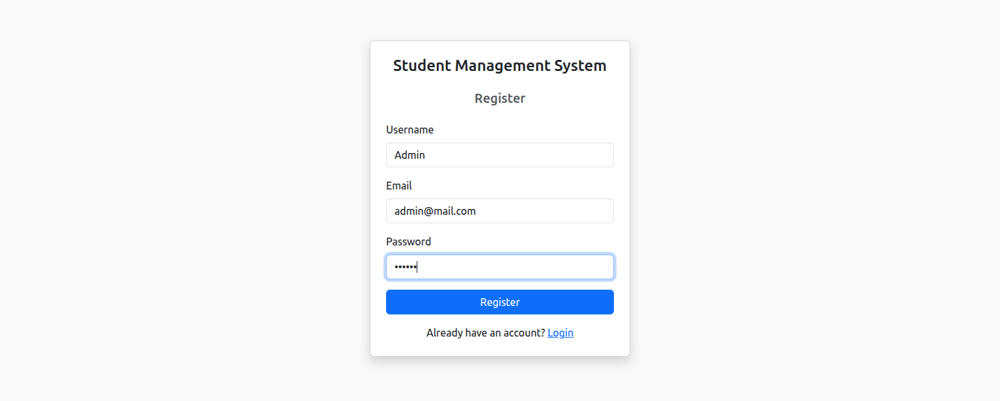

## Student List

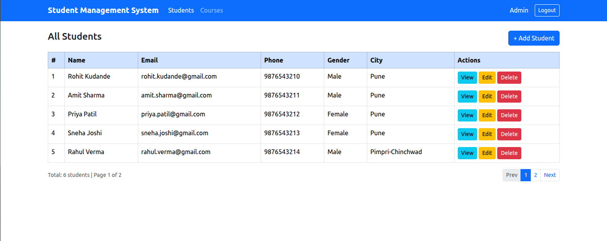

## Add Student

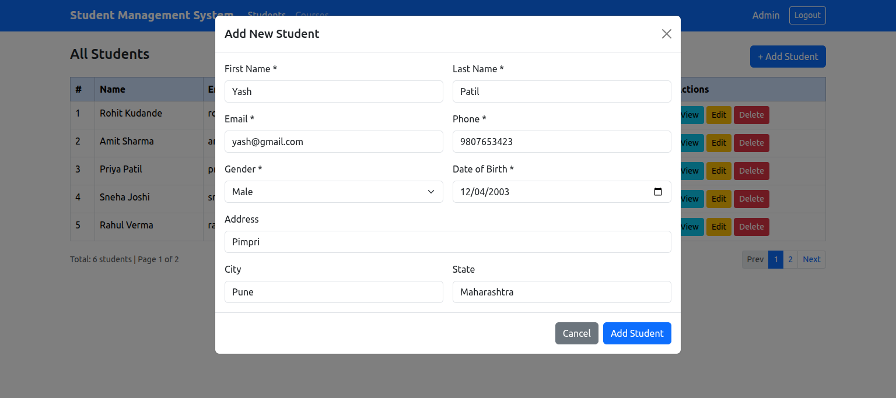

## Student Details

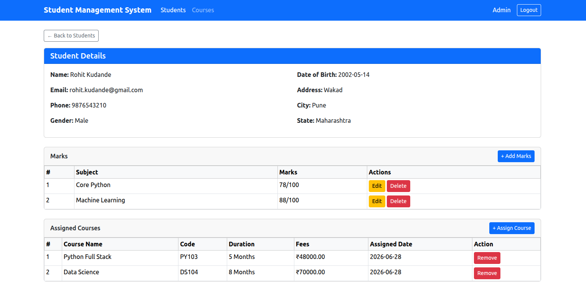

## Courses List

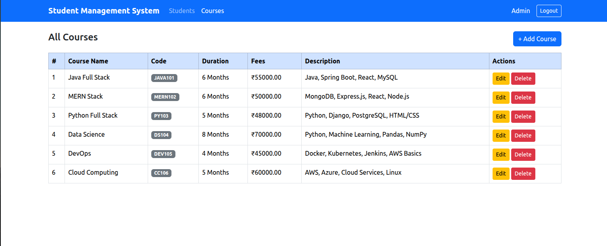

## Add Course

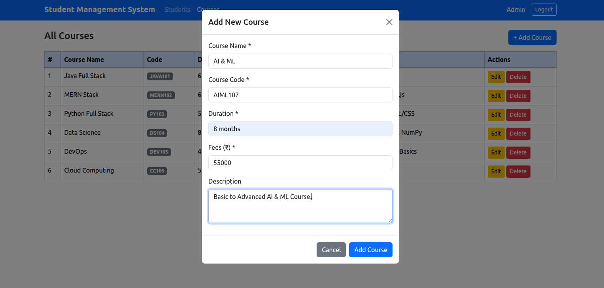

## Update Course

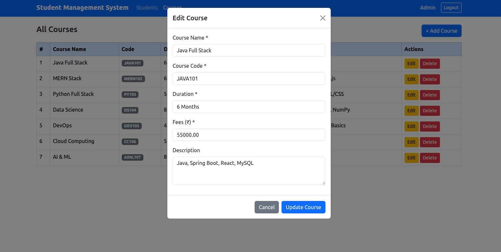

## Assign Course

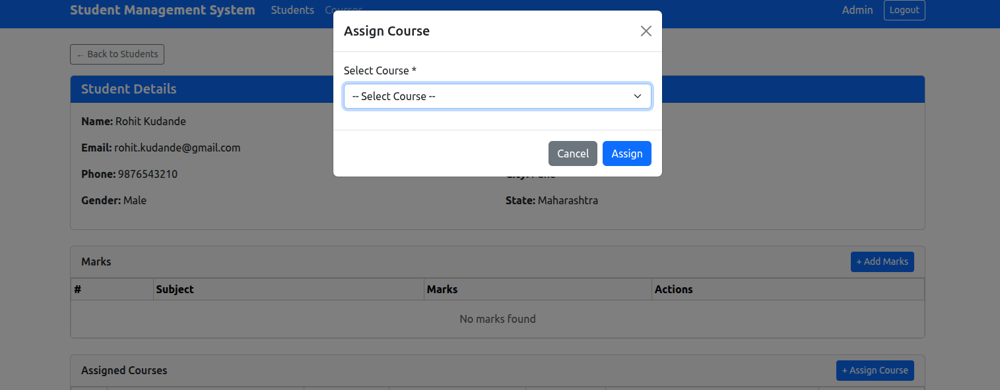

## Add Marks

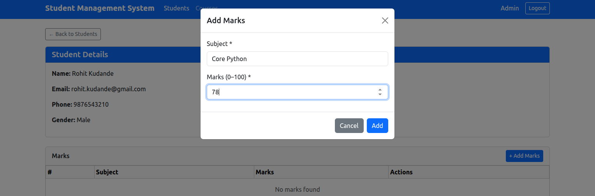

## Success Alert

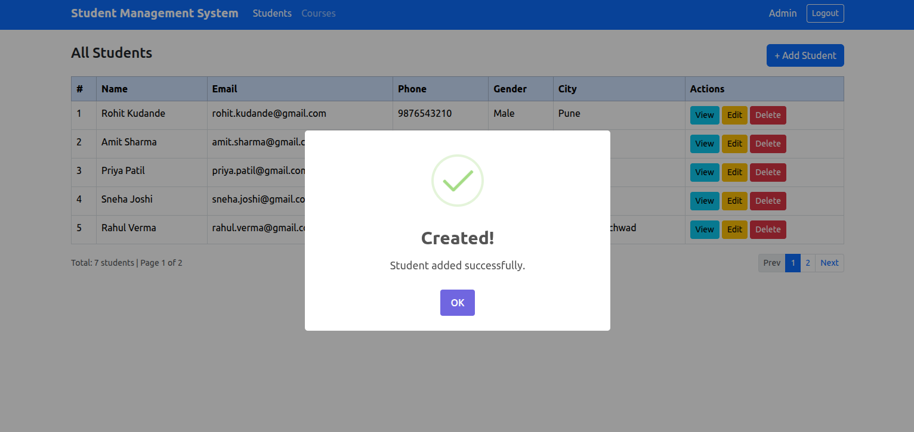

## Delete Course Alert

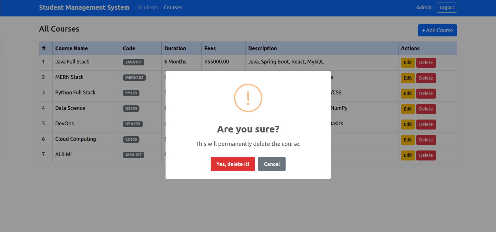
